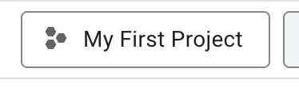

# Problem Brief

A Claude Code skill for product designers who have observations, concerns, or hunches worth surfacing — but not the time to structure them into something shareable.

---

## Why this exists

I believe designers have ideas. Good ones. The instinct is there. The insight is there. What's hard is the gap between having a hunch and doing something with it. Writing isn't my strong suit — but it's how decisions get made. So I built something for that, tested it on a strategy memo I don't know how I would've found the time to write otherwise, and it worked.

We have taste, judgment, and proximity to users — often better reads on what's broken than the briefs we're handed. The gap isn't insight. It's time and structure. Ideas stay fuzzy, stay in your head, or get lost before they reach anyone who can act on them. By the time they're structured enough to share, the conversation has already happened.

This collapses that gap. You dump what you know in rough form — fragments, a hunch, a Slack thread — and it shapes it into a **discovery proposal**: a lightweight, shareable doc that can start a product or roadmap conversation before anyone asks you to. Strategic partnership starts before any tool is open. This is the method for making that count.

---

## What it produces

A v0 problem brief — a Google Doc-style memo a PM, design manager, or collaborator can read in two minutes and react to. Four sections:

1. **What's breaking — and for who** — the specific moment the experience breaks down, described through the user's lived experience.
2. **Why it costs us — stakes and timing** — which metric it most likely touches, what gets worse if nothing changes, and why now.
3. **What we're seeing — observations and assumptions** — evidence labeled by confidence, what's been tried, what's still unknown.
4. **Where I'm taking this — next steps and open questions** — an action already in motion, plus which assumptions still need validation.

The brief is intentionally incomplete. The goal is to earn a conversation, not close one.

---

## How this differs from a PRD or product request form

| | Problem brief | Product request form | PRD |
|---|---|---|---|
| **When** | Before discovery | When you have a clear ask | After a decision is made |
| **Owned by** | Designer, PM, or both | Anyone | PM |
| **Requires** | A signal worth exploring | A solution direction | Full scope and metrics |
| **Goal** | Start a conversation | Route a request | Document what's being built |

A product request form assumes you're done thinking and submitting to a queue. A PRD assumes the problem is already agreed on. A problem brief is for when you've noticed something but haven't been asked to act on it yet — and you want to shape the conversation before it happens without you.

---

## What the skill doesn't know

It helps you think — it doesn't know your organization. Who the right first reader is, what your PM is currently prioritizing, which problems have already been deprioritized and why — that judgment stays with you. The brief gets your thinking out; you decide where it goes.

---

## Installation

### Requirements
- [Claude Code](https://claude.ai/code) (CLI or desktop app)
- Python 3.8+ (for Google Docs export)

### Install the skill

Clone this repo:

```bash
git clone https://github.com/gasperchan/problem-brief.git
cd problem-brief
```

Open the `problem-brief` directory as your Claude Code project. The skill loads automatically from `SKILL.md` in the project root.

To make it available globally across all projects, copy the skill to your Claude user directory:

```bash
mkdir -p ~/.claude/skills/problem-brief
cp SKILL.md ~/.claude/skills/problem-brief/SKILL.md
```

### Run it

In Claude Code, type:

```
/problem-brief
```

Start with a rough thought dump. Fragments, bullets, Slack screenshots, PRD links — all fine.

---

## Export to Google Docs

Once a brief is drafted, the skill offers to export it directly to Google Docs and return a shareable link. Briefs are saved to the `briefs/` directory, which is gitignored so nothing gets accidentally committed.

### Option A: Google Cloud setup (recommended)

One-time setup (~15 min), then export is a single command.

**Part 1 — Create a Google Cloud app**

1. Go to [console.cloud.google.com](https://console.cloud.google.com) and sign in with your work Google account.
2. Click the project dropdown (top left) → **New Project** → give it any name (e.g. `my-claude`) → **Create**.

   
3. In the search bar, search **"Google Docs API"** → click it → **Enable**.
4. Search **"Google Drive API"** → click it → **Enable**.
5. In the left sidebar go to **APIs & Services → Credentials**.
6. Click **+ Create Credentials → OAuth client ID**.
7. If prompted to configure a consent screen first: choose **External**, fill in your app name and email, skip the rest, save. Then return to step 6.
8. On "Create OAuth client ID": choose **Desktop app** → name it anything → **Create**.
9. Click **Download JSON** on the popup → save the file somewhere you'll find it.

**Part 2 — Add credentials to the project**

10. Rename the downloaded file to `credentials.json` and place it in this directory (next to `SKILL.md`).
11. Install the Python dependencies:

```bash
pip3 install google-api-python-client google-auth-httplib2 google-auth-oauthlib
```

**Part 3 — Authorize (one-time)**

The first export attempt will open a browser window asking you to sign in with Google and click Allow. After that, credentials are cached at `~/.problem-brief-token.json` — no re-auth needed going forward.

If the browser window doesn't open automatically, run the export script directly from your terminal:

```bash
cd path/to/problem-brief
python3 export_to_gdocs.py briefs/any-existing-brief.md
```

It will print an auth URL — open it in your browser, sign in, and click Allow. The token is then saved and subsequent exports work without any browser interaction.

**Troubleshooting**

- *"This app hasn't been verified" or "App not approved by your organization"* — This is a Google Workspace restriction. Your IT/admin team needs to allowlist the OAuth client ID. Share the `client_id` from your `credentials.json` when raising the ticket.

- *Export fails silently or auth never completes* — The OAuth flow doesn't always trigger automatically in some terminal environments. Run the script directly in your terminal (as in Part 3 above) to manually complete authorization once, then try exporting from Claude Code again.

### Option B: Pandoc (fallback)

If Google Cloud setup isn't working, export to `.docx` and drag it into Google Drive instead.

```bash
brew install pandoc
```

Ask the skill to export via pandoc. It will save a `.docx` file to `briefs/` that Google Drive opens natively.

---

## A note on healthtech context

If your problem involves clinical outcomes, member safety, or care delivery, the skill labels those signals as observations or anecdotal in the brief. It won't ask you to pull data before drafting. The label sets honest expectations for whoever reads it first.

---

## Contributing

Built for product designers at a mental healthtech company, designed to be shared. If you use it, adapt it, or find gaps — open an issue or PR.
